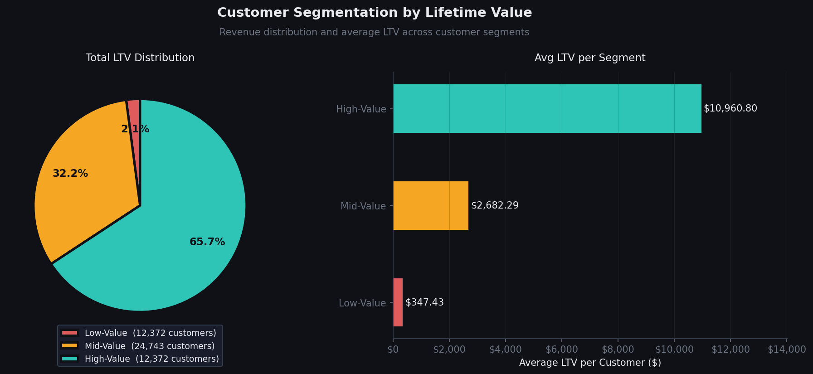
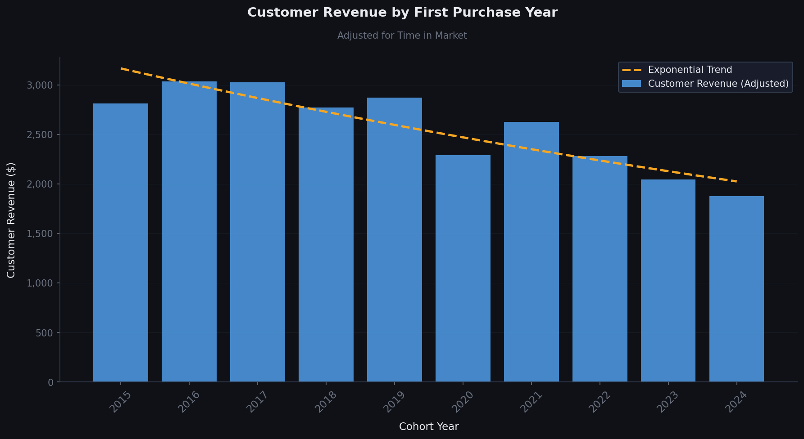
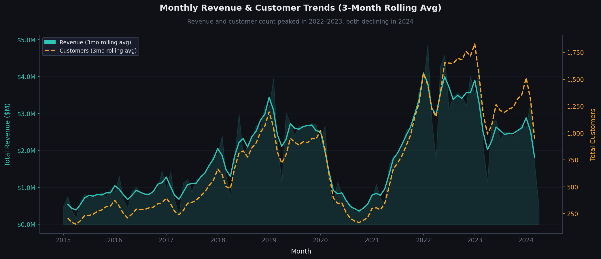
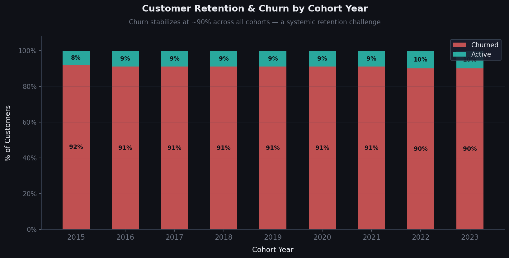

# 📊 SQL Sales Analysis — Analisi Clienti, Coorte e Retention

> Un'analisi SQL del comportamento dei clienti di un'azienda retail, con focus su segmentazione per valore, andamento dei ricavi per coorte e tasso di churn.

---

## 🗂 Indice

- [Contesto](#-contesto)
- [Strumenti Utilizzati](#-strumenti-utilizzati)
- [Preparazione dei Dati](#-preparazione-dei-dati)
- [L'Analisi](#-lanalisi)
  - [1. Segmentazione Clienti](#1-segmentazione-clienti)
  - [2. Analisi per Coorte](#2-analisi-per-coorte)
  - [3. Analisi della Retention](#3-analisi-della-retention)
- [Cosa Ho Imparato](#-cosa-ho-imparato)
- [Conclusioni](#-conclusioni)

---

## 📌 Contesto

Capire il comportamento dei clienti è fondamentale per qualsiasi azienda che voglia crescere in modo sostenibile. Ho condotto un'analisi approfondita del database di vendite di un'azienda retail, con l'obiettivo di rispondere a tre domande chiave:

1. Chi sono i clienti più preziosi e come si distribuisce il loro valore?
2. Come evolvono i ricavi tra le diverse coorti di clienti nel tempo?
3. Quanti clienti continuano ad acquistare e quanti si perdono nel tempo?

Il dataset contiene le transazioni storiche dal 2015 al 2024, con informazioni su ordini, prodotti, clienti e tassi di cambio.

---

## 🛠 Strumenti Utilizzati

| Strumento | Utilizzo |
|-----------|----------|
| **PostgreSQL** | Database relazionale per l'archiviazione e l'interrogazione dei dati |
| **SQL** | Linguaggio principale per tutte le query di analisi |
| **CTEs, Window Functions & PERCENTILE_CONT** | Per query avanzate e analisi multi-step |
| **DataGrip** | Editor per lo sviluppo e il debugging delle query |
| **Python (pandas, matplotlib, numpy)** | Visualizzazione dei dati |
| **Git & GitHub** | Controllo versione e condivisione del progetto |

---

## 🧹 Preparazione dei Dati

**Query:** [`0_View_Creation.sql`](0_View_Creation.sql)

Prima di procedere con le analisi, i dati grezzi di vendite e clienti sono stati aggregati in una singola view (`cohort_analysis`) che:

- Calcola il **ricavo netto** per ogni riga d'ordine (quantità × prezzo netto / tasso di cambio)
- Identifica la **data del primo acquisto** di ogni cliente, fondamentale per l'analisi per coorte
- Unisce i dati transazionali con le informazioni anagrafiche dei clienti

---

## 🔍 L'Analisi

### 1. Segmentazione Clienti

**Domanda:** *Chi sono i clienti più preziosi e come si distribuisce il loro valore totale (LTV)?*

I clienti sono stati classificati in tre segmenti in base al loro **Lifetime Value totale**, utilizzando il 25° e 75° percentile come soglie di separazione.

```sql
WITH customer_ltv AS (
    SELECT customerkey,
           cleaned_name,
           SUM(total_net_revenue)::numeric(10, 2) AS total_ltv
    FROM cohort_analysis
    GROUP BY customerkey, cleaned_name
),
customer_segments AS (
    SELECT PERCENTILE_CONT(0.25) WITHIN GROUP (ORDER BY total_ltv) AS percentile_25,
           PERCENTILE_CONT(0.75) WITHIN GROUP (ORDER BY total_ltv) AS percentile_75
    FROM customer_ltv
)
SELECT CASE
           WHEN c.total_ltv < cs.percentile_25 THEN '1 - Low-Value'
           WHEN c.total_ltv > cs.percentile_75 THEN '3 - High-Value'
           ELSE '2 - Mid-Value'
       END AS customer_segment,
       SUM(total_ltv)    AS total_ltv,
       COUNT(customerkey) AS customer_count,
       (SUM(total_ltv) / COUNT(customerkey))::numeric(10,2) AS avg_ltv
FROM customer_ltv c
CROSS JOIN customer_segments cs
GROUP BY customer_segment
ORDER BY customer_segment DESC;
```

**Risultati:**

| Segmento | N° Clienti | LTV Totale | Avg LTV per Cliente |
|----------|-----------|------------|---------------------|
| High-Value | 12.372 (25%) | $135.606.969 (66%) | $10.960,80 |
| Mid-Value | 24.743 (50%) | $66.367.810 (32%) | $2.682,29 |
| Low-Value | 12.372 (25%) | $4.298.367 (2%) | $347,43 |



**Osservazioni:**

- Il segmento **High-Value** (solo il 25% dei clienti) genera il **66% dei ricavi totali** — un classico effetto Pareto amplificato
- Il gap tra avg LTV High e Low è di **31,5×**: un cliente High-Value vale quanto 31 clienti Low-Value
- Il segmento **Mid-Value** rappresenta la maggior opportunità di crescita: 24.743 clienti già attivi con ampio margine di miglioramento
- Perdere anche solo il 5% degli High-Value significherebbe perdere circa **$6,8M** di ricavi

---

### 2. Analisi per Coorte

**Domanda:** *Come evolvono i ricavi medi per cliente nelle coorti acquisite negli anni?*

I clienti sono stati raggruppati in base al **loro anno di primo acquisto**. Per ogni coorte sono stati calcolati il numero di clienti, il ricavo totale e il ricavo medio per cliente.

```sql
SELECT cohort_year,
       COUNT(DISTINCT customerkey)                                             AS total_customers,
       SUM(total_net_revenue)::numeric(10, 2)                                 AS total_revenue,
       (SUM(total_net_revenue) / COUNT(DISTINCT customerkey))::numeric(10, 2) AS customer_revenue
FROM cohort_analysis
WHERE orderdate = first_purchase_date
GROUP BY cohort_year;
```

**Risultati:**

| Coorte | N° Clienti | Ricavo Totale | Ricavo Medio / Cliente |
|--------|-----------|---------------|------------------------|
| 2015 | 2.825 | $7.939.067 | $2.810 |
| 2016 | 3.397 | $10.309.452 | $3.034 |
| 2017 | 4.068 | $12.308.043 | $3.025 |
| 2018 | 7.446 | $20.639.179 | $2.771 |
| 2019 | 7.755 | $22.261.147 | $2.870 |
| 2020 | 3.031 | $6.942.437 | $2.290 |
| 2021 | 4.663 | $12.246.413 | $2.626 |
| 2022 | 9.010 | $20.565.768 | $2.282 |
| 2023 | 5.890 | $12.036.152 | $2.043 |
| 2024 | 1.402 | $2.633.485 | $1.878 |



**Bonus — Trend Mensile con Media Mobile a 3 Mesi:**

```sql
SELECT DATE_TRUNC('month', orderdate)::date                                   AS year_month,
       COUNT(DISTINCT customerkey)                                             AS total_customers,
       SUM(total_net_revenue)::numeric(10, 2)                                 AS total_revenue,
       (SUM(total_net_revenue) / COUNT(DISTINCT customerkey))::numeric(10, 2) AS customer_revenue
FROM cohort_analysis
GROUP BY year_month;
```



**Osservazioni:**

- Il ricavo medio per cliente è in **calo strutturale**: le coorti 2016–2018 superavano i $2.800, la coorte 2024 è scesa a $1.878 (–33%)
- Il **2022 è l'anno di picco** per volume di acquisizioni (9.010 clienti), ma già con un LTV medio in discesa
- Il **2020** mostra un calo marcato (-20% di clienti e –17% di avg LTV rispetto al 2019), riconducibile all'impatto del COVID
- La linea di trend esponenziale conferma che il declino non è rumore statistico ma una **tendenza sistemica**
- I trend mensili evidenziano una **stagionalità ricorrente**: picchi a febbraio e dicembre, cali ad aprile

---

### 3. Analisi della Retention

**Domanda:** *Quanti clienti di ogni coorte sono ancora attivi e quanti hanno smesso di acquistare?*

Per ogni coorte i clienti sono stati classificati come **Attivi** (acquisto negli ultimi 6 mesi) o **Churned** (nessun acquisto recente), calcolando la percentuale di ciascun gruppo.

```sql
SELECT cohort_year,
       customer_status,
       COUNT(customerkey)                                                        AS num_customers,
       SUM(COUNT(customerkey)) OVER (PARTITION BY cohort_year)                  AS total_customers,
       (COUNT(customerkey) /
        SUM(COUNT(customerkey)) OVER (PARTITION BY cohort_year))::numeric(5, 2) AS status_pct
FROM (
    SELECT customerkey,
           cohort_year,
           CASE
               WHEN MAX(orderdate) >= (SELECT MAX(orderdate) FROM cohort_analysis)
                    - INTERVAL '6 months' THEN 'Active'
               ELSE 'Churned'
           END AS customer_status
    FROM cohort_analysis
    GROUP BY customerkey, cohort_year
) subquery
GROUP BY cohort_year, customer_status;
```

**Risultati:**

| Coorte | Attivi | Churned | % Attivi | % Churned |
|--------|--------|---------|----------|-----------|
| 2015 | 237 | 2.588 | 8% | 92% |
| 2016 | 311 | 3.086 | 9% | 91% |
| 2017 | 385 | 3.683 | 9% | 91% |
| 2018 | 704 | 6.742 | 9% | 91% |
| 2019 | 687 | 7.068 | 9% | 91% |
| 2020 | 283 | 2.748 | 9% | 91% |
| 2021 | 442 | 4.221 | 9% | 91% |
| 2022 | 937 | 8.073 | 10% | 90% |
| 2023 | 455 | 4.263 | 10% | 90% |



**Osservazioni:**

- Il tasso di churn si attesta **costantemente tra il 90% e il 92%** indipendentemente dall'anno di acquisizione: è un problema sistemico, non contingente
- La retention media del **8–10%** è rimasta invariata per quasi un decennio, a indicare che nessuna strategia di fidelizzazione ha prodotto un cambiamento significativo finora
- Le coorti più recenti (2022–2023) mostrano **lo stesso profilo di churn** delle più vecchie: senza interventi mirati, il pattern si ripeterà
- Il dato positivo è che le coorti 2022–2023 mostrano una retention leggermente superiore (10%): potrebbe essere un segnale precoce di miglioramento, da monitorare

---

## 💡 Cosa Ho Imparato

Questo progetto mi ha permesso di approfondire competenze tecniche e analitiche su più livelli:

**Tecniche SQL avanzate:**

- Utilizzo di **CTE multiple** concatenate per scomporre analisi complesse in passaggi leggibili
- Applicazione di **`PERCENTILE_CONT` con `WITHIN GROUP`** per calcolare i percentili in modo preciso
- Uso di **Window Functions** (`SUM OVER PARTITION BY`) per calcolare totali parziali senza perdere il dettaglio di riga
- Tecnica del **`CROSS JOIN`** con una CTE a riga singola per applicare valori globali a ogni record
- Costruzione di **`CASE WHEN` come classificatore** con condizioni multiple ordinate per priorità

**Pensiero analitico:**

- Come trasformare domande di business in metriche concrete e query SQL strutturate
- L'importanza di distinguere tra **trend reale** e rumore nei dati temporali (uso della media mobile)
- Come leggere un grafico barre+linea a **doppio asse Y** per confrontare grandezze con scale diverse
- Come interpretare un **tasso di churn uniforme** tra coorti come segnale di problema sistemico vs. episodico

---

## ✅ Conclusioni

L'analisi ha rivelato tre pattern chiari e interconnessi:

**1. La regola 25/66 sulla segmentazione** — Solo il 25% dei clienti genera il 66% dei ricavi. La concentrazione è tale che la perdita di pochi clienti High-Value ha un impatto sproporzionato. La priorità strategica è proteggere e fidelizzare questo segmento prima di investire nell'acquisizione.

**2. Il declino strutturale del valore per cliente** — Dal 2016 al 2024 il ricavo medio per cliente è calato del 33%. La crescita in volumi (picco nel 2022) ha mascherato questo trend, ma i dati mensili confermano che l'azienda sta acquisendo clienti progressivamente meno redditizi — o che i clienti nuovi acquistano meno rispetto alle generazioni precedenti.

**3. La retention è il vero problema irrisolto** — Con un churn stabile al 90–92% per quasi un decennio, nessuna strategia di fidelizzazione ha prodotto un cambiamento misurabile. Questo dato, letto insieme al calo dell'avg LTV, suggerisce che l'azienda si trova in un ciclo di acquisizione-churn costoso e poco sostenibile nel lungo periodo.

---

*Dataset: Retail Sales Database 2015–2024 | Analisi condotta con PostgreSQL*